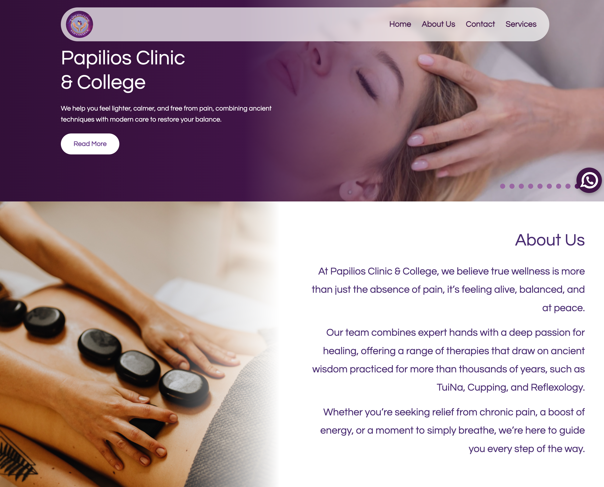

# Papilio’s Clinic & College Website

---

## 🇧🇷 Sobre o Projeto

Este repositório contém o **site da Papilio’s Clinic & College**, desenvolvido como um projeto de front-end com foco em **design responsivo**, **experiência do usuário** e apresentação clara das informações de serviços e missão da organização.

O objetivo do projeto foi criar um site profissional e funcional que mostre os principais serviços, valores e informações de contato de forma acessível em qualquer dispositivo.

---

## 🇺🇸 About the Project

This repository contains the **Papilio’s Clinic & College website**, developed as a front-end project focused on **responsive design**, **user experience**, and clear presentation of service and mission information.

The goal was to build a professional, mobile-friendly site that showcases key services, values, and contact information.

---

## ✨ Funcionalidades | Features

### 🇧🇷 Português
- Layout totalmente responsivo (desktop, tablet e mobile)  
- Seções bem organizadas (serviços, missão e contato)  
- Design limpo e profissional  
- Navegação fácil e intuitiva  
- Conteúdo claro e acessível  

### 🇺🇸 English
- Fully responsive layout (desktop, tablet, and mobile)  
- Well-organized sections (services, mission, and contact)  
- Clean and professional design  
- Easy and intuitive navigation  
- Clear, accessible content  

---

## 🛠 Tecnologias Utilizadas | Technologies Used

### 🇧🇷 Português
- **HTML5** — estrutura semântica  
- **CSS3** — estilos visuais e responsividade  

### 🇺🇸 English
- **HTML5** — semantic structure  
- **CSS3** — visual styling and responsiveness  

---

## 📁 Estrutura do Projeto | Project Structure

📦 SITE-PAPILIOS
┣ 📂 assets
┣ 📜 index.html
┣ 📜 style.css
┗ 📜 outros arquivos

---

## 🚀 Como Executar | How to Run

### 🇧🇷 Português
1. Clone ou baixe este repositório  
2. Abra o arquivo `index.html` em qualquer navegador moderno  

### 🇺🇸 English
1. Clone or download this repository  
2. Open the `index.html` file in any modern browser  

---

## 🧠 Aprendizados | What I Learned

### 🇧🇷 Português
- Desenvolver layout responsivo sem frameworks  
- Organizar conteúdo de forma clara e profissional  
- Aplicar boas práticas de front-end  

### 🇺🇸 English
- Building responsive layouts without frameworks  
- Organizing content clearly and professionally  
- Applying front-end best practices  

---

## 🌐 Link:

https://papiliosclinic.com/

---

## 👩‍💻 Autora | Author

**Francine Mette**  
Front-End Developer  

GitHub: https://github.com/FrancineMette
